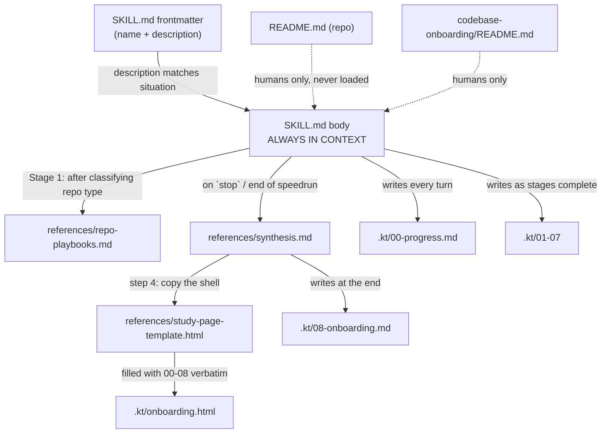

# 02 · Architecture

## The organizing principle: progressive disclosure

**[fact]** The whole architecture is one idea, stated at `README.md:114-116`: `SKILL.md` stays lean
enough to hold in context for an entire run, and heavy material lives in `references/`, "loaded *on
demand*". The README calls this "the main reason a large skill stays reliable."

That single constraint explains every file boundary in the repo.

## Module map

```
nirvajna-skills/
├── README.md          ← repo-level marketing + install + contribution rules (146 lines)
├── LICENSE            ← MIT
├── .gitignore         ← comment only; .kt/ is intentionally tracked here
├── assets/            ← 4 PNGs: light/dark logo + wordmark, used only by README.md
└── codebase-onboarding/          ← the one skill (a self-contained unit)
    ├── SKILL.md       (347 L)    ← ALWAYS loaded: frontmatter + method
    ├── README.md      (396 L)    ← human docs; never loaded by the agent
    └── references/               ← loaded on demand, one read away
        ├── repo-playbooks.md         (360 L) ← 14 playbooks
        ├── synthesis.md              ( 64 L) ← the `stop` procedure
        └── study-page-template.html  (368 L) ← HTML shell for the deliverable
```

**[fact]** Every top-level path is accounted for above — nothing is unexplored.

## Load tiers (how the pieces talk)

There are no imports or function calls. The coupling is **textual**: one document instructs the
agent to read another at a named moment.



**[fact]** The two read-triggers are explicit in the text:
- `SKILL.md:~"Detect the repo type first"` — "read `references/repo-playbooks.md` and follow the
  matching playbook".
- `SKILL.md` (Finishing section) — "Before writing a word of it, **read
  `references/synthesis.md`**".
- `synthesis.md:51` — "Copy `references/study-page-template.html` to `.kt/onboarding.html`."

**[fact]** `study-page-template.html` is reached **only transitively**, via `synthesis.md`. Nothing
in `SKILL.md` reads it directly.

**[inference]** The two `README.md` files are pure dead weight from the agent's perspective — never
referenced by any instruction file. Their audience is a human browsing GitHub. That's deliberate
separation, not an oversight: `README.md:129` tells contributors to "Add a `README.md` for humans."

## The dominant style

**[inference]** Declarative-procedural prose with **checkable postconditions**. The signature
pattern is the "*Done when:*" clause attached to each of the 7 ladder stages in `SKILL.md`.
`README.md:127-128` names this as the repo's core convention: "Give any multi-stage process a
checkable **'done when'** condition per stage — vague criteria are the single most common reason a
skill stops early."

**[inference]** The second recurring style is **anti-pattern naming** — nearly every rule states the
failure mode it prevents ("A speedrun that quietly lowers the bar to go faster has missed the
point"). The instructions are written to survive an agent that wants to shortcut them.
