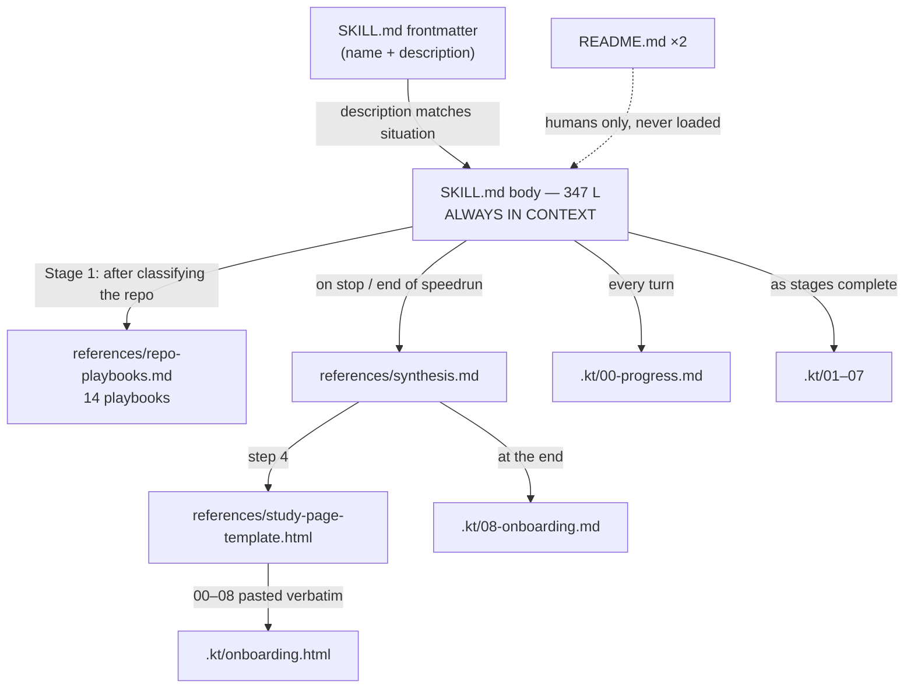

# Onboarding — `nirvajna-skills`

## What this system is

`nirvajna-skills` is a distribution repo for **Claude Code skills** — reusable prompt artifacts,
not software. A skill is a self-contained folder holding a `SKILL.md` plus optional `references/`,
which Claude Code loads into its context when a user's situation matches the skill's description.
There is no build, no runtime, no dependencies: the markdown *is* the product, and the "deploy" is
`cp -r` into a skills directory.

The repo ships exactly one skill today, `codebase-onboarding` — a guided, evidence-based knowledge
transfer procedure for unfamiliar codebases. It explores a repo one stage at a time, tags every
claim with the evidence behind it, keeps an honest map of what it still doesn't know, and leaves a
resumable `.kt/` trail plus a curated onboarding document behind. Twelve tracked files, 1,683 lines
of text, one author.

## Architecture map

The entire design is one idea — **progressive disclosure**. `SKILL.md` is loaded for the whole run,
so it must stay lean; anything only *some* runs need lives in `references/` and is read on demand.
Every file boundary in the repo follows from that constraint.



Coupling is textual, not structural: one document instructs the agent to read another at a named
moment. Both `README.md` files are for humans on GitHub — no instruction file ever reads them.

## Domain glossary

| Term | Meaning | Where |
|---|---|---|
| **Skill** | Self-contained folder Claude Code loads when relevant | `README.md:27-29` |
| **Fog of war** | Governing metaphor — the unlit map matters as much as the lit part | `SKILL.md:20-24` |
| **The core loop** | DISCOVER → EXPLAIN → ASSESS → PROPOSE → CONFIRM, one per turn | `SKILL.md:47-56` |
| **Evidence tag** | `[fact]` / `[inference]` / `[unknown]` / `[human]` on every non-obvious claim | `SKILL.md:68-84` |
| **The ladder** | 7 stages: Orientation → Architecture → Domain → Flows → Dependencies → Operations → Contribution | `SKILL.md:150-180` |
| **"Done when"** | Checkable completion criterion; a stage can't be declared done without it | `SKILL.md:154-158` |
| **Playbook** | One of 13 repo-type adaptations of the ladder, + a generic fallback | `references/repo-playbooks.md:32-360` |
| **The `.kt/` trail** | `00`–`07`: raw, evidence-tagged working record, deliberately unpolished | `SKILL.md:190-215` |
| **The deliverable** | `08-onboarding.md` — curated, written only at `stop` | `references/synthesis.md:1-43` |
| **Coverage check** | Guard that refuses to polish a barely-explored repo | `references/synthesis.md:6-14` |
| **Confidence filter** | Promote `[fact]`/`[human]`, drop guesses, carry unknowns into a named section | `references/synthesis.md:16-26` |
| **`speedrun`** | A standing `continue` — full ladder, no gates, unchanged rigor | `SKILL.md:271-302` |

The evidence tag is the atomic unit: coverage check, confidence filter, and the fog map are all
downstream of it.

## Key flow — a session, end to end

1. **Trigger.** Claude Code matches the user's situation against the frontmatter `description`
   (`SKILL.md:2-10`). That description is the *only* trigger mechanism (`README.md:110-112`), which
   is why it's written as a list of situations rather than a feature summary.
2. **Load.** The body (`SKILL.md:12-347`) enters context. `references/` do not.
3. **Ask the goal, once** (`SKILL.md:30-45`), then announce `.kt/` and begin.
4. **Stage 1, Orientation** runs the core loop (`SKILL.md:47-56`) using the tool list at
   `SKILL.md:92-112`, and must satisfy its criterion at `SKILL.md:160-162`.
5. **Branch on repo type** → read `references/repo-playbooks.md` (`SKILL.md:182-188`). First lazy load.
6. **Write the trail**, rewrite `00-progress.md`, then **stop and wait** — one proposal, two or
   three controls (`SKILL.md:267-269`).
7. **Stages 2-7** repeat, one per `continue`.
8. **`stop`** → read `references/synthesis.md`; run the coverage check (`:6-14`) and confidence
   filter (`:16-26`); write `08-onboarding.md` in the shape at `:33-41`; copy the template to
   `.kt/onboarding.html` and paste each trail file verbatim into its matching
   `<script type="text/markdown">` slot (`study-page-template.html:170-204`), deleting slots for
   files that don't exist.

The template is the repo's only executable code: a hand-rolled markdown renderer
(`study-page-template.html:222`), filter-driven nav, scroll-spy, and copy buttons with a
`<textarea>` fallback — no CDN, no library, opens offline from disk.

## Your first change

**Start here (zero behavioural risk):** `codebase-onboarding/README.md:62` still tells users to
upload `codebase-onboarding.skill`. That file was deleted in commit `9a77940`, and commit `ce43ad1`
fixed the *root* README's wording but missed this one. Mirror the correct phrasing from
`README.md:81-83`. Human-facing docs only — the agent never reads this file.

**Next tier (additive):** add a 15th repo-type playbook. Copy an existing one, keep the five-part
shape, then update the Contents list at `repo-playbooks.md:13-31` **and** the two hardcoded "13
repo-type playbooks" strings (`README.md:100`, `codebase-onboarding/README.md:344`).

**Treat `SKILL.md` as the high-risk file.** Every line is loaded for every run, and the frontmatter
`description` is the single highest-blast-radius string in the repo — weaken it and the skill stops
triggering with no error anywhere.

Verify like this — there is no test suite:

```bash
cp -r codebase-onboarding ~/.claude/skills/
diff -r codebase-onboarding ~/.claude/skills/codebase-onboarding   # must print nothing
# restart Claude Code, then:
#   "what skills do you have available?"   → codebase-onboarding listed
#   "walk me through this repo"            → triggers WITHOUT being named  ← the check that matters
#   /codebase-onboarding                   → one stage, then it STOPS and waits
#   /codebase-onboarding speedrun          → full ladder + 08-onboarding.md + onboarding.html
# NOTE: .kt/ is TRACKED in this repo (a worked example), so restore rather than delete:
git restore .kt
```

The unnamed-trigger check is the important one. A change tested only via the explicit
`/codebase-onboarding` invocation will never catch a broken `description`.

## Assumptions & things to verify

- **The goal was assumed, not stated.** This run was launched as `speedrun` with no stated purpose,
  so it used the default "just understand it" framing. A bug-fix or due-diligence goal would have
  weighted the ladder differently.
- **Repo-type classification is soft.** This is a content/prompt repo, which matches none of the 13
  playbooks; the generic fallback (`repo-playbooks.md:347`) was used, with "state" read as *the
  artifacts a run writes* and "boundaries" as *the host agent runtime*.
- **No code was executed.** Per the read-only rule, nothing was run. In particular the study page's
  markdown renderer was *read*, not tested — its behaviour on real trail markdown is inferred from
  the source. The `onboarding.html` this run produced is the first opportunity to confirm it.
- **[unknown] Does the Claude.ai / Cowork upload path work?** The handling for read-only mounts, a
  missing `.git/`, and a relocated `.kt/` is written (`SKILL.md:118-121`) but nothing in the repo
  shows it was ever exercised.
- **[unknown] Is the missing mermaid ladder a dropped edit?** HEAD (`6e83541`) is a `wip:` commit
  titled "brand hero, badges, mermaid ladder", but `README.md` contains no mermaid block.
- **[unknown] Is a `.skill` bundle published outside the repo** (e.g. as a release asset)? If so,
  `codebase-onboarding/README.md:62` is correct and the finding above is wrong.
- **[unknown] Are more skills planned?** The repo name is plural and the README's table and
  contribution rules are built for many, but it ships one.
- **Cross-file contracts are unenforced.** The `.kt/` filenames appear in `SKILL.md:194-205`,
  `synthesis.md:52-53`, and as `data-id` slots in `study-page-template.html:170-204`; the playbook
  count appears in three places. Nothing checks any of it — there is no CI, linter, or test.
