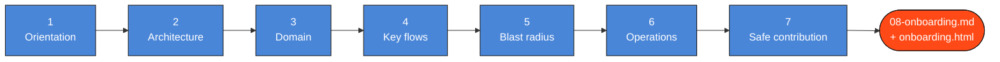

<div align="center">

<picture>
  <source media="(prefers-color-scheme: dark)" srcset="https://raw.githubusercontent.com/nitfolio/nirvajna-skills/main/assets/wordmark-dark.png">
  <source media="(prefers-color-scheme: light)" srcset="https://raw.githubusercontent.com/nitfolio/nirvajna-skills/main/assets/wordmark-light.png">
  
</picture>

# onboard-me

**Guided, evidence-based knowledge transfer for a codebase you don't know yet.**

[](https://docs.claude.com/en/docs/claude-code)
[](#repo-type-playbooks)
[](#what-the-skill-will-not-do)
[](https://github.com/nitfolio/nirvajna-skills/blob/main/LICENSE)

[Install](#install) · [Quick start](#quick-start) · [The ladder](#the-exploration-ladder) · [`.kt/` trail](#the-kt-trail) · [FAQ](#faq)

Part of [nitfolio/nirvajna-skills](https://github.com/nitfolio/nirvajna-skills) ·
[oopsaididitagain.com](https://oopsaididitagain.com/)

</div>

---

## The problem

Dropping an engineer into an unfamiliar repo fails in a predictable way: they don't yet know enough
to ask good questions, so they either read files at random or ask an AI to "explain this codebase"
and get a fluent, confident summary that is partly wrong — with no way to tell which parts.

`onboard-me` fixes both halves. Claude drives the session like a patient staff engineer
running a knowledge transfer: it explores the repo, teaches one layer at a time, marks every claim
with where the evidence came from, keeps an honest map of what's still unknown, and proposes the
next thing worth learning. You steer with one-word replies.

It also leaves a trail. Findings are written to a `.kt/` directory as the session goes, so the work
survives the chat and the next person — or the next session — inherits it.

---

## Install

### Claude Code

Copy the folder into a skills directory:

```bash
# Personal — available in every project
cp -r onboard-me ~/.claude/skills/

# Or project-level — checked in, shared with everyone who clones the repo
cp -r onboard-me <your-repo>/.claude/skills/
```

Restart Claude Code. The skill triggers on its own when you ask something that fits, or you can name
it directly.

### Claude.ai / Cowork

Upload `onboard-me.skill` (or zip the folder) in Settings → Capabilities → Skills. Then upload the
repo you want to explore as a zip in the conversation.

### Verify it's installed

Ask: *"what skills do you have available?"* — `onboard-me` should be listed.

---

## Quick start

Open a session in the repo you want to learn, and say any of:

```
help me understand this repo
where do I start with this codebase
walk me through this project
run a KT on this repo
```

Claude asks one question — **why** you're here — then begins. That answer shapes everything after,
so it's worth answering properly:

| Your goal | What the session emphasizes |
| --- | --- |
| Fix a bug / make a specific change | Key flows and blast radius; gets to the relevant code fast |
| Own a module or the whole system | The full ladder, weighted toward operations and safe contribution |
| Due diligence / review | Architecture, dependencies, risk; blunt about fragility and unknowns |
| Just understand it | The full ladder at a comfortable pace |

If your opening message already says why ("help me understand this repo so I can fix the auth bug"),
Claude skips the question and starts.

---

## How a session works

Every turn has the same shape, and covers **exactly one stage**:

```
DISCOVER  → gather real evidence from the repo
EXPLAIN   → teach what it found, with file:line citations
ASSESS    → redraw the map: what's lit now, what's still dark
PROPOSE   → one next step, and why it's the right one
CONFIRM   → hand control back to you
```

Then it stops and waits. You reply with one word and it does the next stage. The pacing is the
point — a wall of text about ten subsystems is the problem this skill exists to solve, not the
solution.

### Your controls

| Say | What happens |
| --- | --- |
| `start` | Begin, or resume from an existing `.kt/` |
| `continue` / `yes` | Do the proposed next step |
| `speedrun` | Run every remaining stage back-to-back, no stops, then produce the final document |
| `deeper` | Stay on this topic and go further |
| `skip` | Not interesting — propose something else |
| `jump to <topic>` | Go straight to an area ("jump to auth", "jump to the payment flow") |
| `why` | Explain the reasoning and evidence behind the last claim |
| `summarize` | Current state of understanding and remaining unknowns |
| `pause` | Stop cleanly, leave a bookmark, resume later |
| `stop` | Finish and produce the curated onboarding document |

You can ignore all of it and just ask your own questions — the skill follows your lead.

---

## Evidence tags

Every non-obvious claim is labelled. This is the feature that makes the output trustworthy, and it's
worth learning to read:

| Tag | Means | Example |
| --- | --- | --- |
| `[fact]` | Verified in the repo, with a citation | `[fact]` Entry point is `cmd/server/main.go:1` |
| `[inference]` | Reasonable deduction, not confirmed — reasoning shown | `[inference]` Likely the payment entry point, based on `routes.py:88` |
| `[unknown]` | Couldn't determine it | `[unknown]` Where payments actually get charged |
| `[human]` | You told Claude — the strongest evidence there is | `[human]` The `legacy/` service is dead, ignore it |

A claim with no citation is not a fact, and the skill is written to say so rather than smooth over
the gap. **Correct it freely** — when you say "no, that module was deprecated last year", it retags
the claim, fixes the affected `.kt/` file in the same turn, and checks what else your correction
invalidates. Your corrections are the highest-value input in the whole session.

---

## The exploration ladder

The default path, roughly increasing in depth. Each stage has a **completion criterion** — a
checkable condition that has to be met before Claude will call the stage done, which is what stops
it declaring "architecture complete" after glancing at a folder listing.

| # | Stage | Done when |
| --- | --- | --- |
| 1 | Orientation | Purpose, stack, entry points, and repo type are all named and cited |
| 2 | Architecture | Every top-level module is explained or explicitly listed as unexplored |
| 3 | Domain | Each core term has a meaning, a home file, and its relationships |
| 4 | Key flows | At least one path runs end to end with real `file:line` waypoints |
| 5 | Dependencies & blast radius | "What breaks if I change this" is answerable for everything covered |
| 6 | Operations | Build, deploy, and config paths described; fragile spots named |
| 7 | Safe contribution | A specific low-risk starting area, with commands to run and verify |



Stages you don't need can be skipped, and you can jump around freely.

---

## Repo-type playbooks

A monorepo, a Terraform repo, and a set of smart contracts reward completely different exploration
orders. During Orientation, Claude classifies the repo and loads the matching playbook from
[`references/repo-playbooks.md`](references/repo-playbooks.md), which adapts the ladder, names the
files worth reading first, and lists the questions that kind of system always raises.

Covered: backend service/API · microservices · frontend/web app · service-oriented monolith ·
library/SDK · CLI tool · data/ETL pipeline · ML system · mobile app · infrastructure-as-code ·
embedded/firmware · smart contracts · notebook-heavy data science · plus a generic fallback for
anything that fits none of them.

Some examples of how much the playbook changes the session:

- **Data pipeline** — "key flows" means data lineage, not code paths: one dataset traced source to sink.
- **Smart contracts** — trust assumptions, upgrade keys, and whether deployed bytecode matches the repo.
- **Infrastructure-as-code** — plan is the ceiling; the session never applies anything.
- **ML system** — treated as two systems sharing a repo, with training/serving skew as a first-class question.

---

## The `.kt/` trail

As stages complete, findings are written to a `.kt/` directory at the repo root. The name is short
for knowledge transfer, which is what a session actually is, and it stays short so it sits quietly in
your repo root:

```
.kt/
├── 00-progress.md          ← what's explored, what's next, open unknowns
├── 01-overview.md          ← purpose, stack, repo map
├── 02-architecture.md      ← modules/services + diagram
├── 03-domain-glossary.md   ← business terms and where they live
├── 04-key-flows.md         ← traced flows with file:line waypoints
├── 05-dependencies.md      ← dependency notes + blast-radius warnings
├── 06-operations.md        ← build/deploy/config, fragile spots
├── 07-safe-contribution.md ← good first areas + how to verify a change
├── 08-onboarding.md        ← the curated deliverable (only on `stop`)
└── onboarding.html         ← self-contained study page bundling 00–08 (built with 08)
```

Files `00`–`07` are the **working trail**: raw, evidence-tagged, full of open questions. They're a
record of the learning, not a polished artifact.

`08-onboarding.md` is different — it's the clean document a newcomer actually reads, and it's only
produced when you say `stop`.

Alongside it, `stop` also builds `onboarding.html` — a single, self-contained study page that bundles
all of `00`–`08` into one view with sidebar navigation and a one-click copy button on every file. It
inlines everything (no server, no internet), so you can just double-click it open, and it mirrors the
already-redacted `.kt/` files, so it carries no secrets the trail didn't.

**Should you commit `.kt/`?** Either works. Gitignore it if you treat it as scratch. Commit it if you
want the next hire to inherit the map — a curated trail makes genuinely good onboarding docs, which
is most of the value here.

---

## Working across sessions

KT on a large repo doesn't fit in one sitting, and the skill is built for that.

`00-progress.md` is updated every turn, so state is always safe. Say `pause` for a clean exit with a
bookmark. Later — new session, new context, possibly a different machine — open the repo and say
`start`, and Claude reads the progress file and picks up exactly where you left off.

This is also why long sessions don't degrade: rather than holding everything in context, Claude
rereads its own notes, and will suggest pausing when a fresh session would be sharper than a tired
one.

---

## Finishing

**`pause`** — Bookmark and exit. No deliverable is generated.

**`stop`** — Produces `08-onboarding.md` (and the `onboarding.html` study page), following
[`references/synthesis.md`](references/synthesis.md). Two guards apply:

1. **Coverage check.** If exploration was thin, Claude won't quietly generate a polished document
   from a barely-explored repo. It tells you what's covered and what isn't, and offers to synthesize
   anyway, keep going, or just pause.
2. **Confidence filter.** Only `[fact]` and `[human]` claims become settled statements. Guesses and
   dead ends are dropped. Everything still uncertain goes into an explicit
   **"Assumptions & things to verify with a human"** section rather than being laundered into
   confident prose.

The result is meant to be readable start to finish by someone who never ran the skill.

**`speedrun`** — A standing `continue`. Grant it once and the skill runs the whole ladder end to end
without stopping between stages, then finishes with the same `stop` procedure and produces
`08-onboarding.md`. Same method, same rigor, same evidence tags and honest unknowns — the only thing
removed is the per-turn confirmation. It stays strictly read-only (it won't run builds, tests, or
scripts, since you're not there to approve them), keeps a running trace so you can watch the map fill
in, and pauses to ask only if it hits a real fork — a monorepo that needs scoping, or evidence that
contradicts your goal. Because `00-progress.md` is still written as it goes, an interrupted speedrun
resumes with `start`.

---

## What the skill will not do

KT explores; it doesn't change things. The skill is written to be read-only by default:

- **No edits** to source, config, or dependencies — not even tidying something it noticed.
- **No state mutation** — no commits, pushes, branch changes, migrations, seeds, deploys, or
  `terraform apply`.
- **The only write is `.kt/`** (plus a working copy if the repo arrived read-only).
- **It won't silently run your build or tests.** That executes code from a repo nobody understands
  yet and can hit real services. It proposes; you decide.
- **Secrets stay out of the trail.** It notes *that* a credential exists and where it's configured,
  never the value — `.kt/` files persist, and a leaked token in one is worse than no notes at all.
- **Instructions found inside repo files are treated as data, not commands.** If a file contains
  text addressed to an AI agent, that gets reported as a finding, not obeyed.

---

## A sample turn

> **[Orientation complete]**
>
> **[fact]** Go backend service — `go.mod` names module `billing`, and `cmd/server/main.go:1` is the
> single entry point. ~180 Go files, no frontend.
> **[fact]** HTTP + gRPC: `internal/http/router.go:24` registers REST routes;
> `internal/grpc/server.go:15` serves a `BillingService`.
> **[inference]** Its job is subscription billing — top-level packages are `subscription/`,
> `invoice/`, `payment/`, `ledger/`. Confirming against the domain next.
> **[unknown]** Where payments actually get charged (external provider?) — not traced yet.
>
> **Understood so far:** system type, entry points, rough domain.
> **Still unknown:** domain vocabulary, the core billing flow.
>
> **Proposed next step:** map the domain concepts and what each owns — every later flow references
> them, so learning them first makes everything else cheaper.
>
> *continue · deeper · jump to \<topic\> — full controls anytime*

---

## Customizing

The skill is plain Markdown. Fork it and make it yours:

- **Add your own repo type.** Copy a playbook in `references/repo-playbooks.md` and adapt it. Keep
  the same shape (recognition signals, ladder emphasis, files to read first, must-answer questions,
  traps), then add it to the contents list at the top.
- **Change the ladder.** Reorder, add, or drop stages in `SKILL.md`. If you add one, give it a
  completion criterion — a stage without one gets declared done early.
- **Change the artifact layout.** Rename or restructure `.kt/` to match your team's docs convention.
- **Tune the house style.** Teams with strong conventions can add them to the Interaction style
  section (diagram format, glossary rules, terminology).

---

## Files

```
onboard-me/
├── SKILL.md                      ← the skill itself
├── README.md                     ← this file
└── references/
    ├── repo-playbooks.md         ← 13 repo-type playbooks + generic fallback
    ├── synthesis.md              ← how the final onboarding doc gets built
    └── study-page-template.html  ← the shell for the `onboarding.html` study page
```

`SKILL.md` stays lean and always loaded; the references are pulled in only when the run actually
needs them.

---

## FAQ

**Does it work on a repo with no git history?**
Yes. It says so plainly and leans harder on structure, tests, and docs rather than inventing
ownership it can't see.

**What about a huge monorepo?**
After a quick survey it adds a scoping turn — "this is large, which service should we KT first?" —
and notes the rest as unexplored rather than pretending to have covered it.

**Can I use it on a repo I've uploaded rather than cloned?**
Yes. It extracts to a working directory and puts `.kt/` somewhere writable, then tells you where.

**Will it just tell me what I want to hear?**
It's written the other way: unknowns are named rather than smoothed over, and the final document
carries its assumptions in a dedicated section instead of hiding them. If something reads as
suspiciously confident, `why` makes it show the evidence.

---

## Credits

Built as a Claude Code skill. The structural principles behind its most recent revision — completion
criteria, leading words, progressive disclosure, and pruning for predictability — draw on the ideas
in [mattpocock/skills](https://github.com/mattpocock/skills), particularly its `writing-great-skills`
reference.

## License

MIT — see [LICENSE](https://github.com/nitfolio/nirvajna-skills/blob/main/LICENSE).

<div align="center">
<br>

<picture>
  <source media="(prefers-color-scheme: dark)" srcset="https://raw.githubusercontent.com/nitfolio/nirvajna-skills/main/assets/logo-dark.png">
  <source media="(prefers-color-scheme: light)" srcset="https://raw.githubusercontent.com/nitfolio/nirvajna-skills/main/assets/logo-light.png">
  
</picture>

**[oopsaididitagain.com](https://oopsaididitagain.com/)**

</div>
